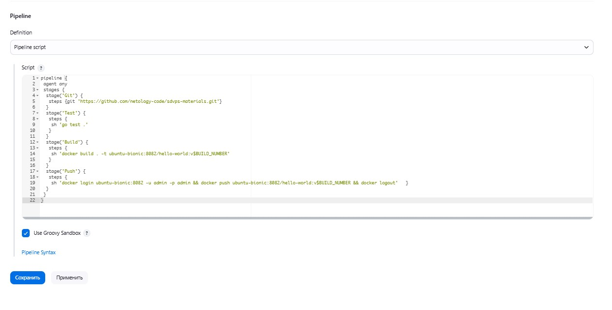
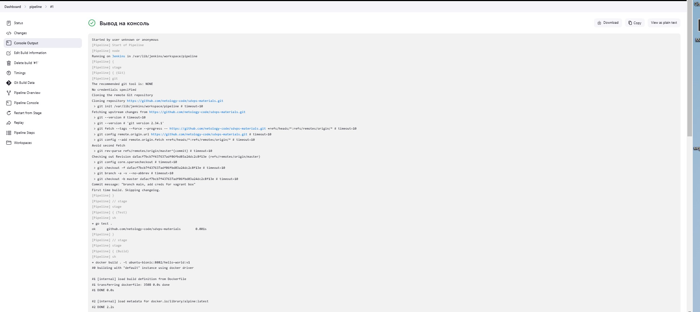
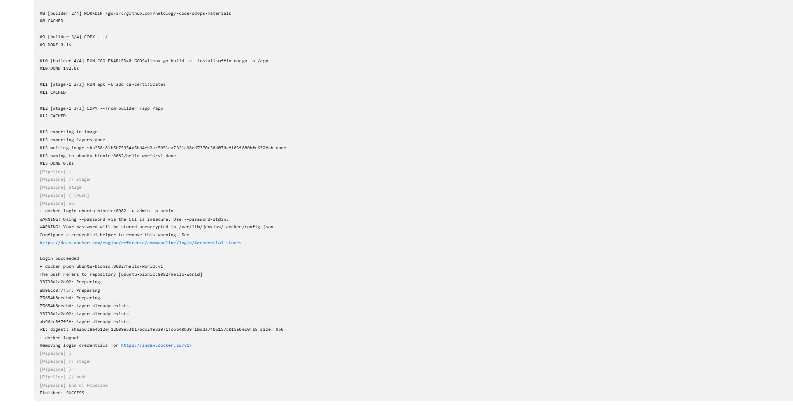
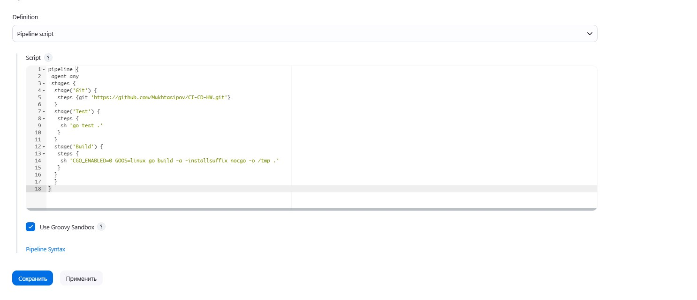
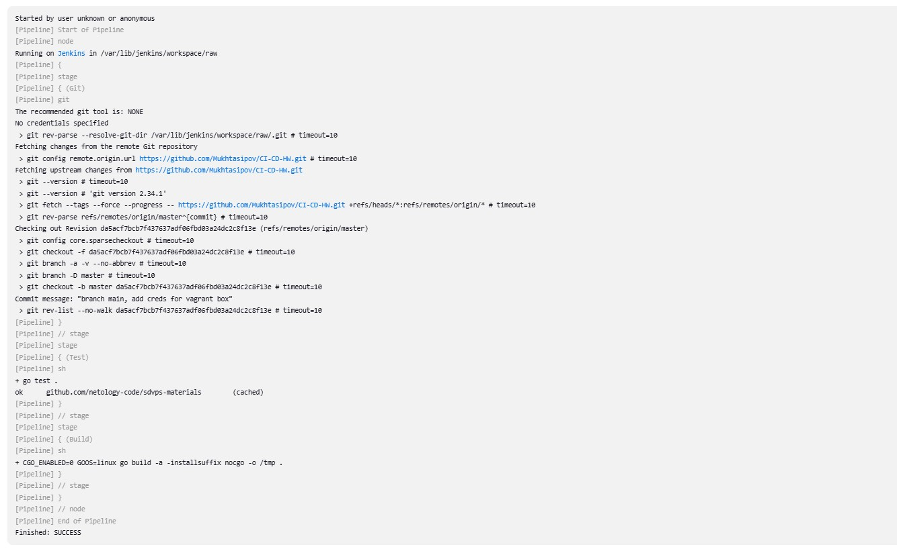

# Домашнее задание к занятию "`Что такое DevOps. СI/СD`" - `Мухтасипов Александр`

### Задание 1

1. `Установите себе jenkins по инструкции из лекции или любым другим способом из официальной документации. Использовать Docker в этом задании нежелательно.`
2. `Установите на машину с jenkins golang.`
3. `Используя свой аккаунт на GitHub, сделайте себе форк репозитория. В этом же репозитории находится дополнительный материал для выполнения ДЗ.`
4. `Создайте в jenkins Freestyle Project, подключите получившийся репозиторий к нему и произведите запуск тестов и сборку проекта go test . и docker build ..`
5. `Заполните здесь этапы выполнения, если требуется ....`
    
    `В качестве ответа пришлите скриншоты с настройками проекта и результатами выполнения сборки.`

`При необходимости прикрепитe сюда скриншоты
## Скриншоты настройки
 

## Скриншоты вывода

---

### Задание 2

`Что нужно сделать:`

1. `Создайте новый проект pipeline.`
2. `Перепишите сборку из задания 1 на declarative в виде кода.`
   
   `В качестве ответа пришлите скриншоты с настройками проекта и результатами выполнения сборки.`

`При необходимости прикрепитe сюда скриншоты
## Скриншоты настройки
 

## Скриншоты вывода

---

### Задание 3

`Что нужно сделать:`

1. `Установите на машину Nexus.`
2. `Создайте raw-hosted репозиторий.`
3. `Измените pipeline так, чтобы вместо Docker-образа собирался бинарный go-файл. Команду можно скопировать из Dockerfile.`
4. `Загрузите файл в репозиторий с помощью jenkins.`

    `В качестве ответа пришлите скриншоты с настройками проекта и результатами выполнения сборки.`

`При необходимости прикрепитe сюда скриншоты
## Скриншоты настройки
 

## Скриншоты вывода

